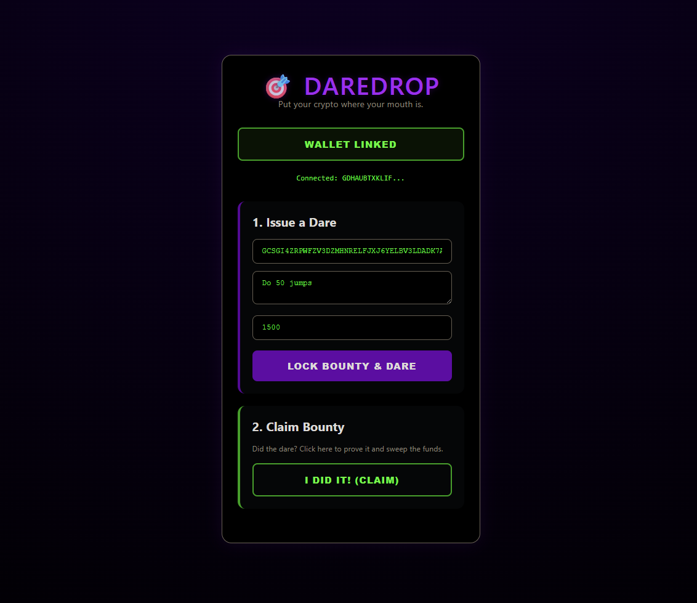
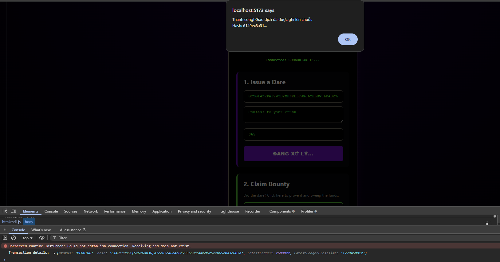

# 🎯 DareDrop



## Problem
Students frequently challenge each other to fun campus dares, but there is no reliable way to ensure the promised reward is actually paid out upon completion, leading to broken promises and lost bets.

## Solution
DareDrop is a decentralized escrow dApp where users lock up a crypto bounty alongside a dare. If the target completes the task, they cryptographically sign to claim the bounty, making peer-to-peer bets trustless and fun.

## Why Stellar
Stellar's near-zero transaction fees (~$0.000003) make it economically viable to lock up micro-bounties without losing money to network gas fees.

## Target User
University students and campus communities looking to gamify their social interactions with real, albeit small, stakes.

## Live Demo
- **Network:** Stellar Testnet
- **Contract ID:** `CCFQQES5ENX7LIPEPSUXWVQVU2O7L74CNMGMFQRGTTZJJFNYTVQUPU4P`
- **Transaction:** [https://stellar.expert/explorer/testnet/tx/649075b341e9e2789375cf28af3c27fa409e98d2f2e835a7ed514ad41f7186eb](https://stellar.expert/explorer/testnet/tx/649075b341e9e2789375cf28af3c27fa409e98d2f2e835a7ed514ad41f7186eb)



## How to Run Locally
1. Clone: `git clone https://github.com/leequoming/daredrop-stellar.git`
2. Build Contract: `stellar contract build`
3. Deploy: `stellar contract deploy --wasm target/wasm32-unknown-unknown/release/daredrop.wasm --source-account student --network testnet`
4. Frontend: 
   ```bash
   cd frontend  
   npm install
   npm run dev

## Tech Stack
- Smart Contract: Rust / Soroban SDK v22
- Frontend: HTML / CSS / Vanilla JS (Direct Freighter Extension API)
- Wallet: Freighter
- Network: Stellar Testnet

## Team
- [Lê Quang Minh] | [2512205298@student.hcmus.edu.vn] | [HCMUS - Artificial Intelligent - First year]
- [Nguyễn Đình Ngọc Khoa] | [HCMUS - Artificial Intelligent - First year]
- Role: Blockchain Builder
- GitHub: https://github.com/leequoming
